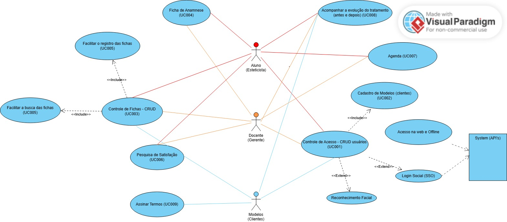

# Projeto Estética T99

## Informações Gerais

**Projeto:** Sistema de Controle para Esteticistas  
**Versão:** 1.0.0  
**Data de Início:** 22/07/2025  
**Data de Término (Prevista):** 22/08/2025  

## Objetivo do Projeto

Criar um sistema web/mobile de agendamento e controle de clientes e processos para a área de estética.

## Diagramas de UML

### Diagrama de Casos de Uso (Use Case)

## Levantamento de Requisitos

| UseCase # |         Descrição         | Status | Prioridade |        Dificuldade         |
|-----------|---------------------------|--------|------------|----------------------------|
|   RF001   |   Controlar Acesso (3)    |   -    |     1      |        Complexo (5pts)     |
|   RF002   |   CRUD - Modelos (3)      |   -    |     1      |         Médio (3pts)       |
|   RF003   |    CRUD - Fichas (3)      |   -    |     2      |        Complexo (5pts)     |
|   RF004   |   CRUD - Anamnese (3)     |   -    |     1      |         Médio (3pts)       |
|   RNF005  |     Registro e Busca      |   -    |     -      |             -              |
|   RF006   |  Pesquisa de Satisfação   |   -    |     3      |         Médio (3pts)       |
|   RF007   |        Agenda (3)         |   -    |     3      |        Complexo (5pts)     |
|   RF008   | Acompanhar Tratamento (3) |   -    |     4      |         Médio (3pts)       |
|   RF009   |  Termos de Consentimento  |   -    |     4      |        Simples (1pt)       |
|           |                           |        |   TOTAL    |           28pts            |
|           |                           |        |   Horas    | 112 horas * 40 = R$4800,00 |

**Observação:** Usar de 1 a 2 horas por ponto (2h Pleno | 4h Júnior).  

**Valor por hora:** R$25,00 (Júnior) | R$50,00 (Pleno) | R$80,00 (Senior)

**Média de Mercado:** Salário Júnior R$3500,00 / 120h = R$30,00/hora

**Margem de Lucro:** R$30,00 * 1,3 = R$40,00/hora~

**Imposto:** R$40,00 * 1,15 = R$46,00

## Tarefas

|    A Fazer     |        Fazendo         |        Feito          |
|----------------|------------------------|-----------------------|
| [ ] Montar CTA | [W] Montar Wireframe   |[D] Montar Orçamento   |  
|                |                        |[D] Montar Contrato    |

## Leads

Landing Page com captação de Leads - R$ 1200,00 à R$ 3500,00

São campos onde os clientes se cadastram para receber descontos, novidades, etc.

## Definir a tecnologia do sistema

- Sistema Web R$ 8.000,00 | App Android / iOS R$ 45.000,00
- HTML + CSS + JS | Frameworks (REACT.js / Bulma / Bootstrap)
- PHP + SQL R$ 10,00 | Python com Flask R$ 60,00
- MySQL | PostgreSQL | Oracle | DBII

## Comandos Docker Compose

`docker compose up -d --build` - Criar e Iniciar os containers 

`docker compose down` - Desligar containers
`docker ps -a` - Listar containers ativos 

`docker stop (numeroContainer)` - Desativar container existente 

`docker rm (numeroContainer)` - Deleta o container (e seus dados) 

`docker compose run (nome/ID bash)` - Acessar o terminal de um container 

* Comandos do Composer

`docker compose exec web composer --version` - Testando Composer 

`docker compose exec web composer create-project laravel/laravel /var/www/html/application` - Criando projeto Laravel

## Algoritmo - Coleta de e-mails (Leads)

- Preencha o campo e-mail (obrigatório)
- Confirmar a aceitação dos Termos & Condições (obrigatório)
- Envia os dados para o PHP
- PHP cadastra no Database (banco de dados)